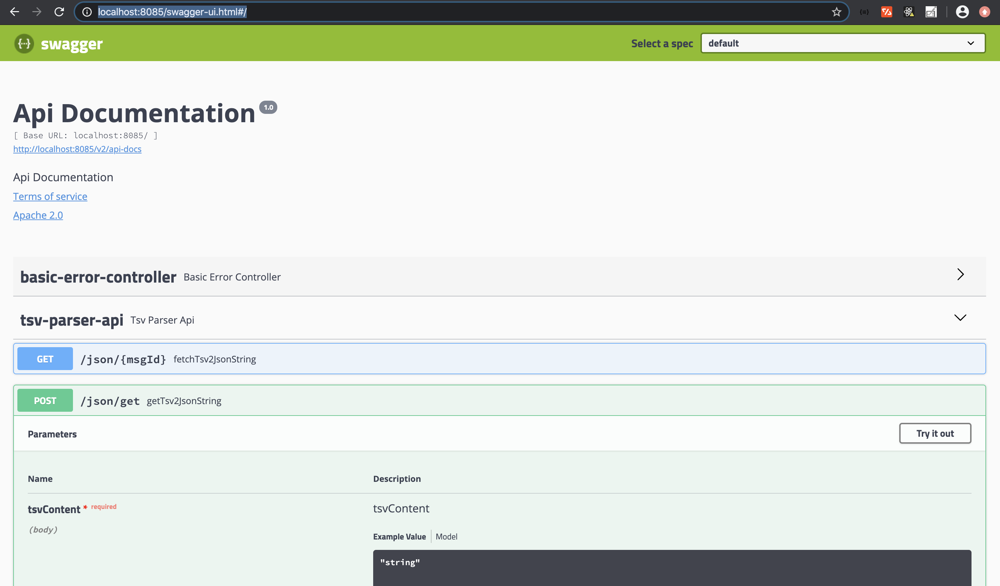
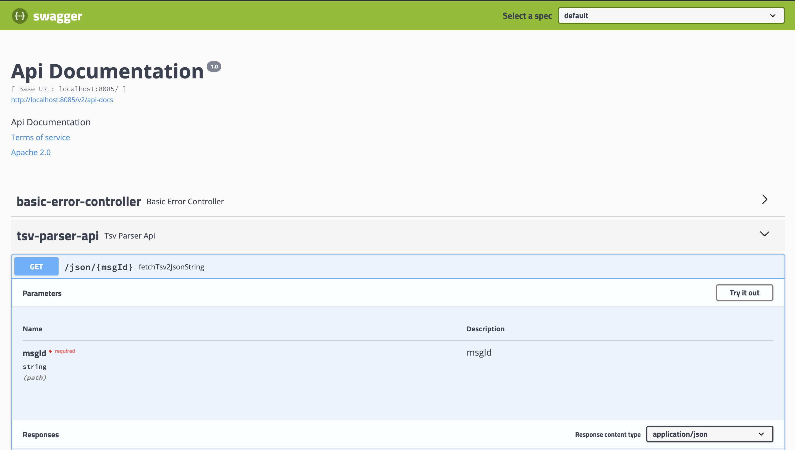

# spring-boot/java project for tsv to json api

### Pre-requisite
   1. Java should be installed
   2. Maven should be installed
   
### Steps to build project 
   mvn clean install 
   
### steps to run project 
  copy executable jar from target folder 
  run with command " java -jar tsv2jsonparser-0.0.1-SNAPSHOT.jar"
  
  Api will listen to port 8085
  
### Swagger Api is accessible at [http://localhost:8085/swagger-ui.html#/](http://localhost:8085/swagger-ui.html#/)

### Test Api for tsv -> json generator

### Test Api to retrieve tsv and json based on msg id [ part of generated url]

